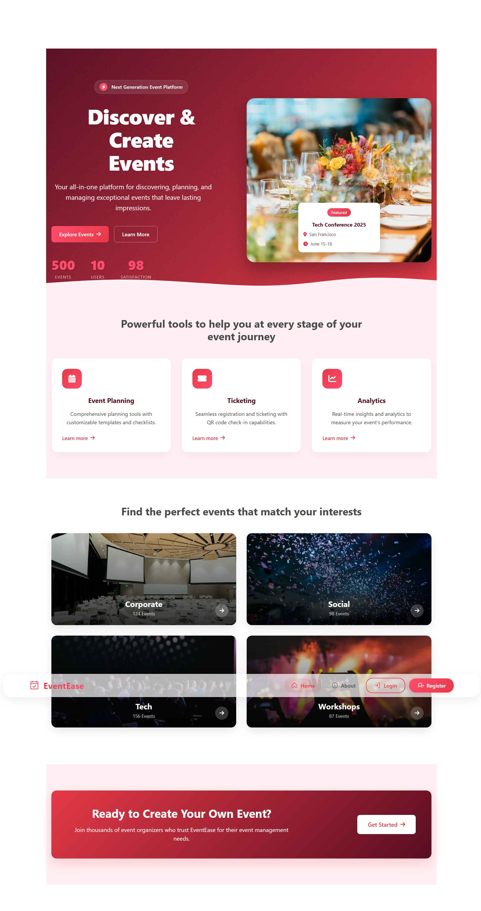
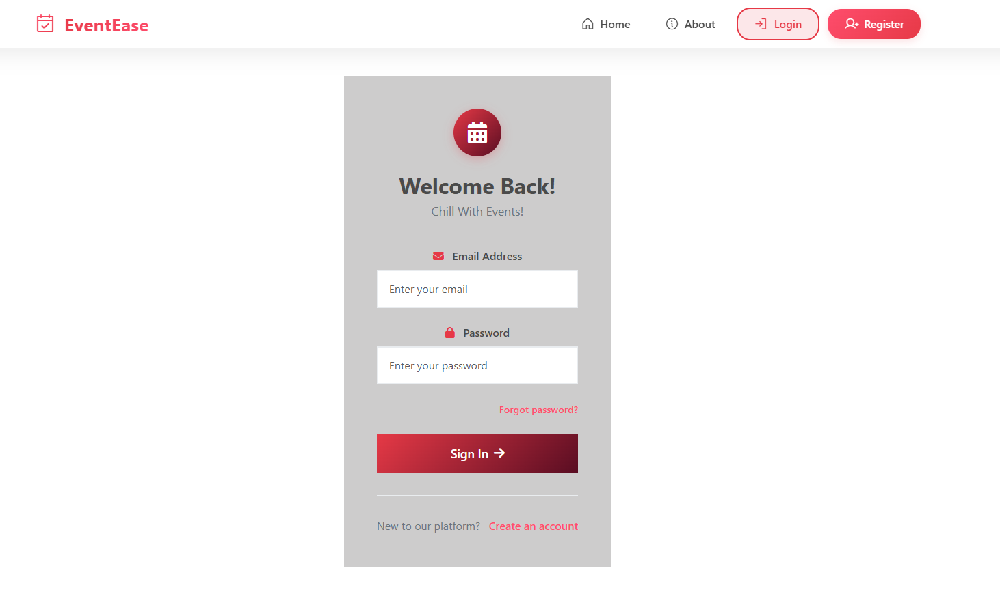
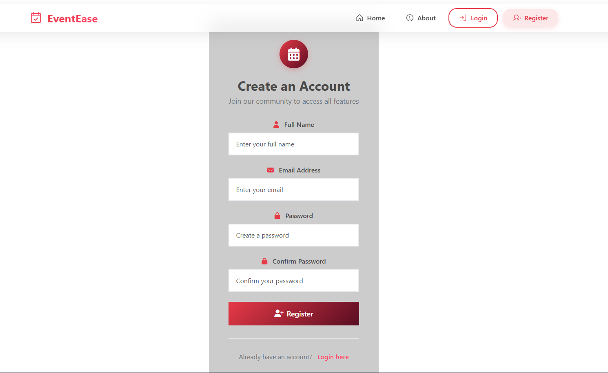
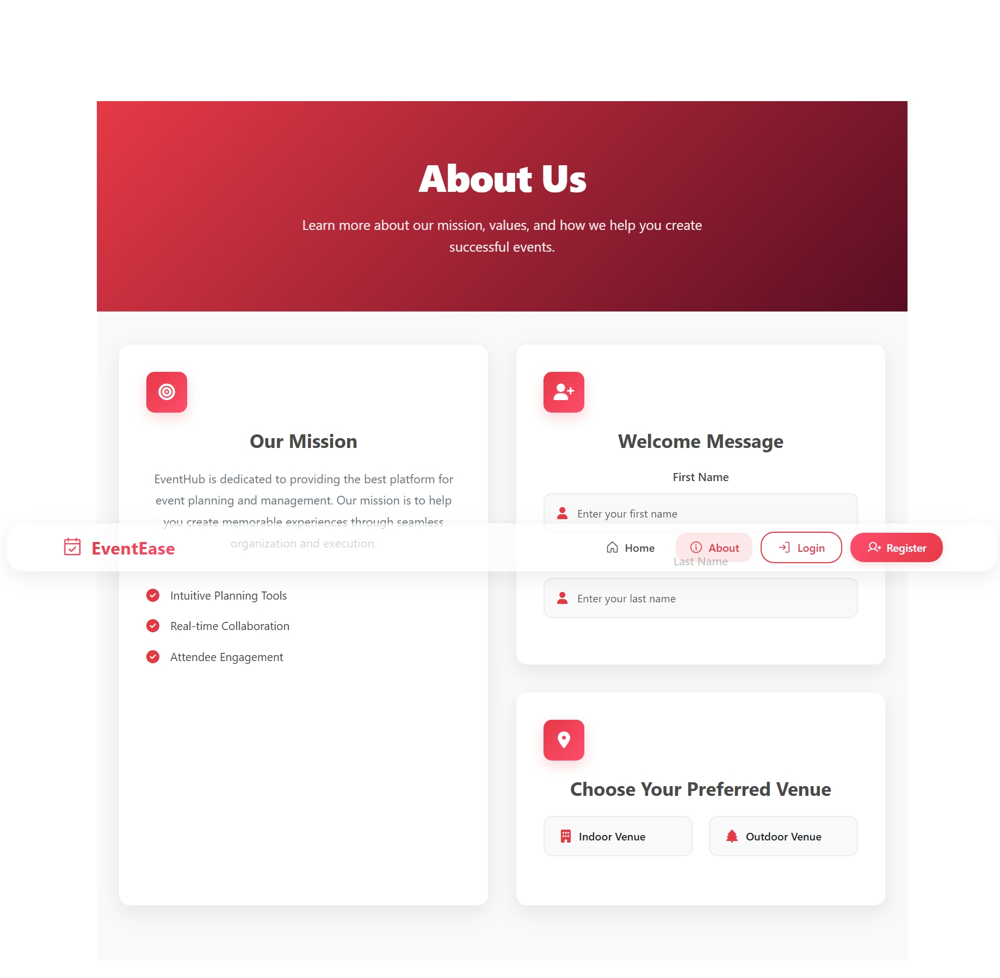

# 🎉 Event Management Platform

A modern event management application built with **Vue.js 3**, **TypeScript**, and **Pinia**, offering a seamless experience for creating, managing, and participating in events.

---

## 🚀 Features

### 🔧 Core Functionality
- **Event Management**: Create, edit, and delete events with rich details.
- **User Authentication**: Secure registration and login system.
- **Real-time Updates**: Dynamic content updates using Pinia state management.
- **Interactive UI**: Modern and responsive design with smooth transitions.

### 🎫 Event Features
- **Advanced Filtering**:
  - Categories: Music, Technology, Sports, etc.
  - Date filtering
  - Search functionality
- **Event Details**:
  - Title and description  
  - Date and time  
  - Location  
  - Capacity management  
  - Price  
  - Category  
  - Status tracking (Upcoming / Ongoing / Completed)

### 👤 User Interactions
- **Event Registration**: Users can register for events.
- **Like System**: Like or unlike events.
- **Capacity Tracking**: Real-time attendance tracking.
- **User Profiles**: Personalized user dashboard and interactions.

---

## 🛠️ Technical Stack

| Category         | Technology                     |
|------------------|-------------------------------|
| **Frontend**     | Vue.js 3 (Composition API)     |
| **Type Safety**  | TypeScript                     |
| **State Mgmt**   | Pinia                          |
| **Styling**      | CSS3 with custom variables     |
| **Icons**        | Font Awesome                   |
| **Routing**      | Vue Router                     |
| **Storage**      | Local Storage                  |
| **Tooling**      | Vite, ESLint                   |

---

## 📱 Responsive Design

- Fully responsive layout  
- Mobile-first approach  
- Adaptive components  
- Touch-friendly interfaces  

---

## 🔒 Security Features

- Form validation  
- Protected routes  
- Secure user authentication  
- Authorization checks for sensitive actions  

---

## 🔧 Configuration

The application is set up using:

- **Vite**: Fast development build tooling  
- **ESLint**: For maintaining code quality and standards  
- **TypeScript**: Strong typing for better development experience  

---

### 🏠 Home Page  

  

### 🔐 Login Page  

  

### 📝 Register Page  

  

### ℹ️ About Page  

---

